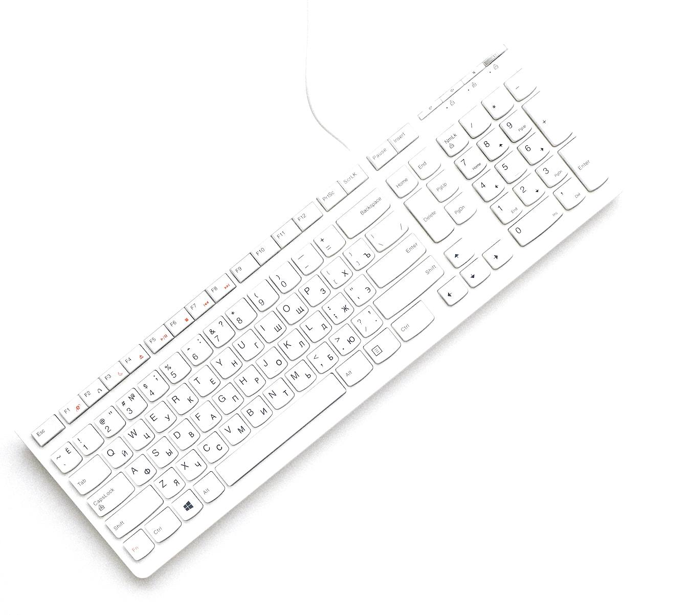

<html>
	<head>
		<title>LC Labs</title>
		<meta charset="utf-8" />
		<link rel="icon" href="%PUBLIC_URL%/favicon.ico" />
		<meta name="viewport" content="width=device-width, initial-scale=1, user-scalable=no" />
		<link rel="stylesheet" href="assets/css/main.css" />
	</head>
	<body>
		<!-- Nav -->
			<nav id="nav">
				<ul class="container">
					<li></li>
					<li><a href="https://lauren-cun.medium.com/" class="icon brands">Medium</a></li>
					<li><a href="https://www.linkedin.com/in/lauren-cun/" class="icon brands">LinkedIn</a></li>
					<li><a href="https://github.com/laurencun" class="icon brands">Github</a></li>
				</ul>
			</nav>
		<!-- Home -->
			<article id="top" class="wrapper style1">
				

					

						

							
						

						

							<h2>Hi, I'm <strong>Lauren Cunningham</strong>.</h2>
							
As a software engineer, I get the privilege to work on applications that directly impact the lives of others by building connections and simplifying everyday processes. 
							I love contributing to open-source projects and building responsible, forward-thinking products.

							<a href='mailto:lauren.busbee@gmail.com' class="button large scrolly">Contact Me</a>
						

					

				

			</article>
		<!-- Work -->
			<article id="work" class="wrapper style2">
				

					<header>
						<h2>Full Stack Development</h2>
						
Here's some of the languages and tools I'm currently working with.

					</header>
					

						

							<section class="box style2">
								
								<h3>JavaScript</h3>
							</section>
						

						

							<section class="box style2">
								
								<h3>React</h3>
							</section>
						

						

							<section class="box style2">
								
								<h3>Ruby</h3>
							</section>
						

						

							<section class="box style2">
								
								<h3>Ruby on Rails</h3>
							</section>
						

						

							<section class="box style2">
								
								<h3>Postgresql</h3>
							</section>
						

					

				

			</article>
		<!-- Portfolio -->
			<article id="portfolio" class="wrapper style3">
				

					<header>
						<h2>Portfolio</h2>
						
Recent and on-going projects

					</header>
					

						

							<article class="box style2">
								
								<h3><a href="https://codeforchicago.org/">Code for Chicago</a></h3>
								
Non-profit organization supporting civic tech initatives

							</article>
						

						

							<article class="box style2">
								
								<h3><a href="http://ww-world.herokuapp.com/">Wide Wide World</a></h3>
								
Social traveler's photography forum

							</article>
						

						

							<article class="box style2">
								
								<h3><a href="http://codingcollective.herokuapp.com/">Coding Collective</a></h3>
								
Plan or join collaborative networking events for software developers

							</article>
						

						

							<article class="box style2">
								
								<h3><a href="https://www.chimilkweed.com/">Chicago Milkweed Project</a></h3>
								
Educating public school students about the milkweed plant's role in the ecosystem

							</article>
						

					

					<footer>
						
Looking for a developer to join your team?

						<a href='mailto:lauren.busbee@gmail.com' class="button large scrolly">Get in touch with me</a>
					</footer>
				

			</article>
		<!-- Contact -->
			<article id="contact" class="wrapper style4">
				

					

						

							

							<h3>Find me on ...</h3>
							<ul class="social">
								<li><a href="https://lauren-cun.medium.com/" class="icon brands">Medium</a></li>
								<li><a href="https://www.linkedin.com/in/lauren-cun/" class="icon brands">LinkedIn</a></li>
								<li><a href="https://github.com/laurencun" class="icon brands">Github</a></li>
								<!--
								<li><a href="#" class="icon solid fa-rss">RSS</a></li>
								<li><a href="#" class="icon brands fa-instagram">Instagram</a></li>
								<li><a href="#" class="icon brands fa-foursquare">Foursquare</a></li>
								<li><a href="#" class="icon brands fa-skype">Skype</a></li>
								<li><a href="#" class="icon brands fa-soundcloud">Soundcloud</a></li>
								<li><a href="#" class="icon brands fa-youtube">YouTube</a></li>
								<li><a href="#" class="icon brands fa-blogger">Blogger</a></li>
								<li><a href="#" class="icon brands fa-flickr">Flickr</a></li>
								<li><a href="#" class="icon brands fa-vimeo">Vimeo</a></li>
								-->
							</ul>
							

						

					

					<footer>
						<ul id="copyright">
							<li>&copy; LCLabs. All rights reserved.</li><li>Design: <a href="http://html5up.net">HTML5 UP</a></li>
						</ul>
					</footer>
				

			</article>
		<!-- Scripts -->
			
			
			
			
			
			
	</body>
</html>